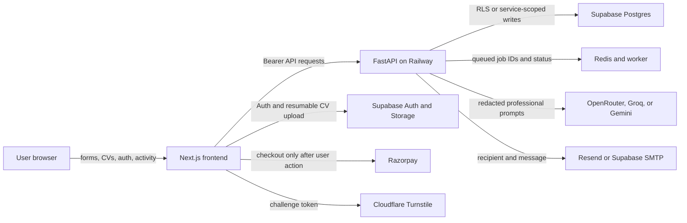

# Personal Data Flow Audit

Date: 2026-07-25  
Scope: tracked backend, frontend, browser extension-adjacent API contracts, scripts, SQL migrations, and live Supabase schema metadata.

## Executive result

Myro collects substantially more than account credentials once a user chooses to use CV, career, application, feedback, payment, or Myrology features. The primary system of record is the single Supabase project. Railway runs the API and workers; Redis holds short-lived queue/status records; selected professional content is sent to configured AI providers.

This pass removed durable frontend PII caches, disabled GA delivery, minimized payment/Turnstile/email transfers, redacted identifiers at the logging boundary, filtered identity responses, protected password/token representations, and added self-service deletion across Storage, database, and Auth.

## Collection and destination map

| Data | Entry points | Internal path and storage | External recipient |
|---|---|---|---|
| Email | Signup/login/magic link, profile, newsletter, institution form, outreach/admin tools | FastAPI; Supabase Auth; `user_profiles`, `magic_link_attempts`, `newsletter_subscribers`, institution/growth tables | Supabase Auth/SMTP; Resend for transactional email; OAuth provider when selected |
| Password | Email signup and login forms | Sent directly to Supabase Auth over TLS; not stored by app code | Supabase Auth only |
| Name/display identity | Optional signup metadata, profile, CV header, institution/contact forms | Supabase Auth metadata; `user_profiles`; CV structured data; institution/growth records | Supabase; Resend when included in a message; direct CV header is stripped before AI calls |
| Phone | CV upload or pasted CV; free-text feedback/notes if supplied | CV raw/structured records and revisions in Supabase | Direct phone patterns are stripped before AI calls |
| Address/location | Profile targets, CV header/roles/education, career profile, birth place | `user_profiles`, CV tables, `career_profile`, `myrology_intake` | Professional location may be present in AI prompts where needed; CV header lines are removed first |
| Date of birth and birth time | Myrology intake | `myrology_intake` | No dedicated astrology API exists; configured AI providers may receive the intake only when a Myrology generation feature invokes the common LLM boundary |
| CV files and text | PDF/DOCX upload, pasted text, CV editor, LinkedIn export import | Short-lived browser memory/session state; account-bound IndexedDB pending upload; private `cv-uploads` bucket during resumable transfer; CV text/structured/version tables | Supabase Storage; professional text to configured AI provider after direct-identifier redaction |
| Career history and compensation | Career profile, CV, diary/reservoir, persona/memory tools | Career, CV, diary, memory, persona, private note, and story tables | Necessary professional context to configured AI providers for requested analysis/generation |
| Job search and application activity | Search, save, apply handoff, stages, notes, feedback, milestones | Search, match, application, intent, exposure, feedback, notification, and milestone tables; short-lived Redis jobs | No advertising analytics; AI receives job/CV context only for requested matching or writing |
| Public contributions | Comments, public ninja profile, feedback attachments/text | Comments/profile/feedback tables | Public profile exposes only the deliberate public contract; comments are public by design |
| Payment data | Product checkout and Razorpay callback/webhook | `billing_payments` stores amount, currency, opaque receipt, Razorpay order/payment IDs and signature | Razorpay handles payment instrument details; Myro never receives full card/UPI/bank credentials |
| IP address | API/network edge, magic-link/newsletter abuse controls, anonymous rate limits | In-memory anonymous limiter; IP fields in abuse-control tables; application logs now redact IPs | Railway/Vercel/Supabase/Cloudflare necessarily observe network source IP; Turnstile no longer receives `remoteip` from Myro |
| Device/browser information | Beta feedback form, user-agent header, route performance | Feedback and route performance tables | Hosting providers observe normal HTTP metadata; GA is no longer loaded |
| OAuth identity | Google or LinkedIn sign-in and optional LinkedIn metadata | Supabase Auth identities; selected profile metadata in `user_profiles` | Google/LinkedIn and Supabase Auth |
| Quiz, Forge, XP, and diary activity | Authenticated learning/product actions | Quiz, skill, Forge, XP ledger, diary, milestone tables | AI receives selected text only for requested coaching/extraction |
| Myro telemetry | Route timings, CV lifecycle, anonymous download identifier | Supabase telemetry tables; tab-scoped anonymous ID | No GA transfer after this pass |

## Browser storage audit

| Storage | Current contents | Retention and protection |
|---|---|---|
| Memory | React Query data, identity snapshots, in-flight CV text/file | Lost on refresh or tab close |
| `sessionStorage` | App bearer/refresh tokens, Supabase session, unsaved CV draft, feedback/apply outboxes, XP snapshot, referral/attribution bridge, anonymous CV continuity | Tab-scoped; cleared on logout/account deletion; still JavaScript-accessible, so CSP/XSS prevention remains essential |
| `localStorage` | Theme/accent/layout/sort/template preferences, onboarding hints, opaque upload job/idempotency keys | No profile, CV body, email, feedback body, tokens, match data, or XP balance |
| IndexedDB | One account-bound pending CV `File`, source, opaque idempotency key, owner subject | Deleted when upload lands, when owner differs, or after 24 hours |
| Cookie | `myro_ref`, a public user-chosen referral slug | `SameSite=Lax`; `Secure` on HTTPS; intentionally not `HttpOnly` because the cross-origin signup bridge reads it; it is not a credential |

The prior full React Query cache and profile/score identity snapshots were removed from `localStorage`. The Supabase browser client and Myro session adapter now use tab-scoped storage rather than durable cookies/local storage.

## Password and authentication handling

- Plaintext passwords exist only in the short-lived request object and the TLS call to Supabase Auth.
- Pydantic models use `SecretStr`, preventing accidental representation in diagnostics.
- The app never stores, logs, returns, hashes, or forwards passwords to any non-auth service.
- Supabase Auth performs salted bcrypt password hashing and stores the hash in its managed Auth schema.
- Access and refresh tokens are response fields only on auth/session endpoints and are stored tab-scoped.
- Deleted Auth users cannot be auto-provisioned again by a locally valid, not-yet-expired JWT.

## Third-party minimization

| Service | Required data still sent | Removed or constrained in this pass |
|---|---|---|
| Supabase | Auth credentials, user-owned application data, private CV upload objects | All tables verified with RLS enabled; service role remains backend-only; account deletion now spans app data and Auth |
| OpenRouter/Groq/Gemini | Requested professional text, job context, coaching/generation prompts | Common outbound filter removes email, phone, IP, UUID, and URLs; first three CV header lines are removed; raw exception text is not logged |
| Razorpay | Opaque order receipt, product amount/currency/order ID | Removed profile name/email prefill, user ID, XP amount, product notes, user-supplied receipt; script loads only after checkout click |
| Resend/Supabase SMTP | Recipient email, sender, subject, message body | Logs no longer contain subject, recipient, response body, or raw network exception |
| Cloudflare Turnstile | Challenge response token and server secret | Removed optional visitor `remoteip` field |
| Google/LinkedIn OAuth | Identity and provider-authorized profile fields | Only selected provider metadata is persisted; integration can be revoked |
| Redis/Railway worker | Opaque user/job/ticket IDs and job state needed to execute work | Application log filter replaces UUIDs/IPs/emails/phones/tokens; payload content is not printed |
| Google Analytics | Nothing | GA scripts and `NEXT_PUBLIC_GA_ID` configuration removed |

No active Stripe, Twilio, Firebase, AWS, Sentry, PostHog, or SendGrid send path was found. SendGrid remains a dependency/config compatibility surface, but transactional sends use the Resend HTTP service.

## API response filtering

- `UserProfileResponse` no longer returns the internal profile UUID, referrer UUID, account creation time, or last-active time.
- Signup/login, post-signin, and extension-session responses no longer return internal user IDs or duplicate profile email.
- Password and refresh-token request fields use secret-safe representations.
- Existing public comments/profile and CV/job response models were checked for deliberate field-level contracts.
- Resource IDs required for client actions, such as job, CV version, upload job, application, and booking IDs, remain opaque operational identifiers.
- The central exception boundary returns generic errors; secrets and direct identifiers are redacted before logs.

## Logs changed

- The global filter now redacts credentials, connection strings, provider keys, JWTs, emails, phone numbers, IPv4/IPv6 addresses, and UUIDs, including Uvicorn access logs and exception trace text.
- Payment, email, auth-adjacent, AI, CV parsing, CV editing, and maintenance-script logs no longer print raw user values or upstream response bodies.
- CV skill names and career reservoir titles/company history were removed from diagnostics.
- Frontend CV unmount diagnostics no longer attach the raw error object.

## Account deletion flow

`DELETE /users/me` now:

1. Clears every object below the authenticated user's private `cv-uploads/{user_id}/` prefix.
2. Calls `public.delete_my_account_data()` with the caller's RLS-scoped JWT.
3. Anonymizes referral/authorship references on shared rows.
4. Deletes every public UUID `user_id` ownership row, including feedback, billing, CV, Myrology, career, search, application, learning, memory, notification, and telemetry data.
5. Deletes `user_profiles`.
6. Permanently deletes the Supabase Auth user.
7. Clears browser session state and redirects home.

The database function is `SECURITY DEFINER`, has an empty `search_path`, takes no user ID argument, derives identity only from `auth.uid()`, denies `anon`, and grants execution only to `authenticated`. It was applied to the live shared Supabase project and its grants were verified. No live account deletion was executed during this audit.

## Residual and operational considerations

- Hosting, database, OAuth, email, anti-bot, and payment processors necessarily receive network metadata such as IP address and user agent at their edge. Application-level forwarding/logging has been minimized, but provider retention is governed by provider contracts.
- AI redaction catches direct identifiers and CV headers. Names embedded in narrative career bullets or free text cannot be detected perfectly without risking destructive content changes; users should be told that requested AI features send necessary professional text to configured providers.
- Tab-scoped tokens remain JavaScript-accessible. A strict Content Security Policy, dependency review, output escaping, and XSS regression testing remain critical.
- IndexedDB contains an encrypted-transport but locally unencrypted pending CV for upload resilience for at most 24 hours. Browser disk compromise is outside the app's protection boundary.
- The dynamic account-erasure function covers future tables only when they follow the canonical UUID `user_id` ownership convention. Schema review must flag other ownership column names.
